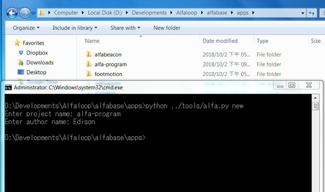

Alfabase 小程式
================

## 什麼是 Alfabase 小程式
#### 如果把 Alfabase 裝置比喻成一個人的話，那麼小程式就是靈魂，Alfabase 就是神經，硬體裝置肉軀。  
在這裡舉一個簡單的例子說明，Android 手機由各家廠商來製作、改良自家的 OS 版本，並且各家的手機大多都可以在 Google play 商店中下載手機應用程式使用。
這邊所提到的手機應用程式其實跟小程式的概念是一樣的，手機就跟搭載 Alfabase OS 的裝置是同樣概念。  
在各個硬體裝置的基礎之上(例如某手環、某 beacon 等等...)，開發者在開發任一種裝置應用的時候，
需要從最底層開始，驅動、應用等等的漸進式向上層應用程式開發，透過 Alfabase OS 的小程式則不需要深入底層也能進行上層應用開發，
甚至不需要考慮到省電策略，並且同時間可以受到 Alfabase OS 的管理與保護，多個小程式的安裝、切換及設定等等，讓開發各種裝置變得更簡單。  
  
  
## 小程式開發流程
<p align="center">
<br/>
圖一、開發流程圖
</p>  

## ELF loader
ELF loader 是 Contiki OS 中一個讓嵌入式系統可以在不需要重置或重啟裝置的情況下就能夠隨時抽換核心「應用程式」的模塊。
Alfabase 整合了 Contiki OS，開發人員能夠在 Alfabase 直接使用這個模塊並且透過呼叫 [Alfabase API](https://www.alfaloop.com/docs/alfaos/#os-framework) 開發「Alfabase 小程式」。
  
## Alfabase 小程式開發工具
開發 Alfabase 小程式除了 [Alfabase](https://github.com/AlfaLoop/alfabase) 以外，還需要 [alfabridge](https://github.com/AlfaLoop/alfabridge-android) 等工具，甚至可以搭配 [nRF Connect for Mobile](https://play.google.com/store/apps/details?id=no.nordicsemi.android.mcp) 除錯與測試。
  
- [Alfabase](https://github.com/AlfaLoop/alfabase)  
Alfabase 系統，目錄中的 [tools/](https://github.com/AlfaLoop/alfabase/tree/master/tools) 資料夾的 [alfa.py](https://github.com/AlfaLoop/alfabase/blob/master/tools/alfa.py) 工具用來管理小程式專案，可建構、編譯及上傳小程式到 Alfabase 裝置中。
在 [apps/](https://github.com/AlfaLoop/alfabase/tree/master/apps) 資料夾中有一些範例小程式可以參考，例如 [HelloWorld](https://github.com/AlfaLoop/alfabase/tree/master/apps/helloworld)。
  
- [alfabridge](https://github.com/AlfaLoop/alfabridge-android)  
alfabridge 目前支持 Android 系統，並且僅相容於支持藍牙 4.0(BLE) 模塊的裝置。主要用來協助 PC 與裝置間的小程式傳輸與部署。
  
## 如何開發
- 建立專案  
在 apps/ 中呼叫 [alfa.py](https://github.com/AlfaLoop/alfabase/blob/master/tools/alfa.py) 建立新小程式專案  
```bash
cd alfabase/apps/
python ../tools/alfa.py new
```
並且輸入專案名稱(小程式名稱)與開發者名稱(非必填)  
<p align="center">
<br/>
圖二
</p>  
  
- 開發與編譯  
會產生剛剛建立的小程式專案資料夾，進入後會有基本的 app.conf 與 main.c 檔案。
資料夾中的 app.conf 描述小程式的專案設定，main.c 則是小程式的主要程序，初始時包含基本的 Timer 和 Logger 的使用範例。  
小程式的代碼開發可以參考 [apps/](https://github.com/AlfaLoop/alfabase/tree/master/apps) 其他範例專案與 [Alfabase API](https://www.alfaloop.com/docs/alfaos/#os-framework)。
接下來進行小程式的編譯
```bash
cd PROJECT-NAME
python ../../tools/alfa.py build
```
<p align="center">
<br/>
圖三
</p>  
產生的 PROJECT-NAME-app.elf 就是小程式編譯檔。
  
- 上傳與執行  
產生了 .elf 檔後，就可以上傳到裝置中執行，需要搭配 alfabridge 上傳小程式。  
首先先建立 alfabridge 與裝置的連線，  
<p align="center">
<br/>
圖四
</p>  
點擊開始設定偵測附近 Alfabase 裝置，  
  
<p align="center">
<br/>
圖五
</p>  
  
靠近 Alfabase 裝置一段時間，  
<p align="center">
<br/>
圖六、與裝置完成配對  
</p>  
  
偵測到附近的 Alfabase 裝置後，alfabridge 會和裝置連線，我們在透過 alfabridge 屏幕上的區域網路 ip 位址對 Alfabase 裝置下命令即可對裝置進行操作。  
alfa.py 的 install 與 run 命令分別代表上傳小程式及執行小程式，必要附加參數 -i IP_ADDRESS (alfabridge 上顯示的 ip 位址)。  
```bash
python ../../tools/alfa.py install -i 192.168.1.XX
python ../../tools/alfa.py run -i 192.168.1.XX
```
<p align="center">
<br/>
圖七  
</p>  
透過以上命令即可完成小程式的部署！  
  
PS.
1. Android 裝置必須與 PC 在同一個區域網路中。  
2. 要對裝置下達 run、kill、setboot、delboot 等等命令，須在欲部屬的小程式專案目路下運行 alfa.py  
  
## alfa.py 工具命令選項
  
```bash
python alfa.py 命令 [-i IP_ADDRESS]
```
  
|命令|描述、說明|
|:---:|:---:|
|new|建立小程式專案|
|build|編譯小程式 elf 檔|
|clean|清除專案中的編譯檔|
|install|上傳指定專案小程式到裝置|
|remove|移除裝置中的小程式(指定專案)|
|remove_app_files|移除裝置中的所有小程式|
|run|執行指定專案小程式|
|kill|中止執行中的小程式|
|ts|同步時間到裝置中|
|list|取讀裝置中已安裝的小程式列表|
|setboot|設置執行中的小程式為裝置開機自動執行|
|delboot|清除裝置開機自動執行的小程式設置|
|airlog|監聽裝置的 air log 訊息|
|version|打印當前版本
  
PS. PC 本地端操作的命令無需附加 -i 參數，如 new、build、clean、version 等。
  
  
## Alfabase 裝置狀態

Alfabase 裝置在未下達任何命令的時候，屬於無狀態。  
下達 run 命令之後，裝置會開始執行指定的小程式，例如 footmotion 鞋墊應用，這時裝置的狀態為執行中。
在執行中的狀態下，無法再次下達 run 的命令，但是可以透過 kill 使裝置回到無狀態，kill 命令會終止當前執行中的小程式。  
setboot 命令會設置當前執行中的小程式為裝置開機自動執行，當裝置更換電池或重新啟動之後，設置自動啟動的小程式會在開機後自動執行，
setboot 必須在執行中的狀態下才可使用。delboot 則反之，須要已設置 setboot 的狀態下才可使用。
  
<p align="center">
<br/>
圖八、裝置狀態轉換圖  
</p>  


